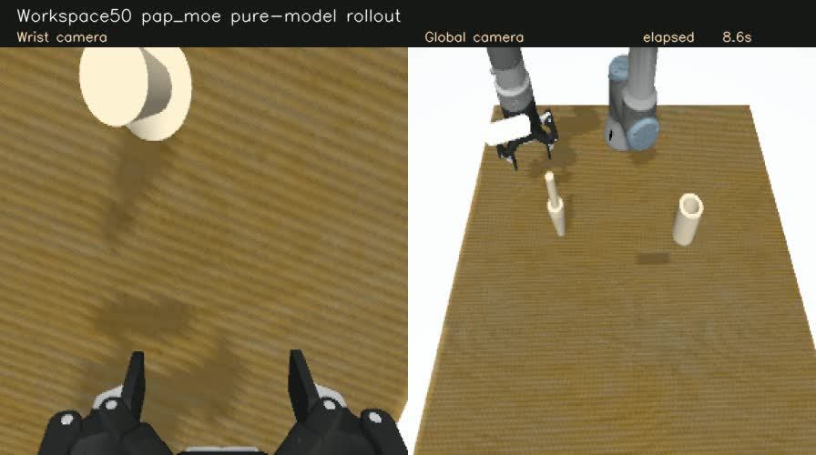

# PAP-MoE · UR3 多模态接触操作研究平台

基于 **ROS 2 / Gazebo / MoveIt 2 / LeRobot / Pi0.5**，构建 UR3 + FT300 + Robotiq 2F-85 的轴孔装配数据采集、策略训练和闭环评估链路。研究四个物理感知专家能否为动作生成提供有效条件，改善接触操作与视觉退化下的表现。

> **研究状态：已实现学习策略的部分 Gazebo 装配成功案例；尚未证明 PAP-MoE 稳定优于 Pi0.5。本文展示仿真，不宣称实机策略部署或工业级安全性。**

## 先看演示与结果

[](docs/assets/pap_moe_B_ep0001_seed1.mp4)

[下载 / 播放完整视频](docs/assets/pap_moe_B_ep0001_seed1.mp4)：**PAP-MoE B 检查点的模型推理**，Workspace50 的 0001 / seed1，50 步预测、10 步执行、RTC。不是脚本示教，不是人工接管；视频未加速。按原插入判据成功，但该判据不等价于主动夹持插到底或松爪后稳定。来源和 SHA256 见 [演示清单](docs/assets/demo_manifest.json)。

| 实验批次（不能跨行合并计分） | 结果 | 说明 |
|---|---|---|
| 五位置 × 三 seed，2026-09-08 | Pi0.5 **6/15**；PAP S3 **0/15**；S4 **4/15** | 历史执行版本；后续发现夹爪插件问题，不作为最终架构优越性证据 |
| 修复插件，五位置 × seed0 | Pi0.5 参考 **1/5**；接口 A **0/5**；B **1/5** | 记录同执行合同；不能声称整体提升 |
| 修复插件，四个历史成功组合配对 | S4 **2/4**；B **2/4**；真实路由适配 GT **2/4**；预测路由适配 Pred **1/4** | 成功病例选择的回归集，不是总体成功率估计 |

这些模型的信息输入并不完全相同：Pi0.5 基线不使用 PAP 的 FT 条件。证明“专家模块本身有效”还需要同输入基线与专项测试。完整口径、负结果及数据来源见 [实验结论](docs/reports/PAP_MoE推进顺序与实验结论_简版_20260907.md) 和 [可机读结果摘要](docs/results/lineage_results.json)。

## 我在项目中做了什么

以下是本仓库的项目级开发范围，不把上游模型、驱动或 AI 辅助生成代码宣称为从零独立实现。个人分工及提交归属可结合 Git 历史进一步核实。

- **仿真与控制集成**：UR3、FT300、2F-85 和双相机组合；桌面/轴孔几何、工作空间、MoveIt/Servo 与控制器联调；夹爪联动与停滞检测诊断。
- **数据工程**：完整轨迹与键鼠采集、同位置多风格示范、模态记录、LeRobot 转换、全帧归一化统计审计；恢复采集作为独立流程保留。
- **PAP-MoE 研究实现**：四物理专家、三因子 PhysicsGate、逐动作步路由、动作 Transformer 输入条件融合、分阶段与联合训练配置。
- **部署与验证**：50/10 RTC、常驻模型与逐条 Gazebo 重启、请求/动作配对、同观测完整 Flow 回放、源代码/统计/插件指纹审计、成功与失败记录。

上游贡献、修改边界及许可证见 [来源与贡献说明](docs/CONTRIBUTIONS.md)。Pi0.5/ACT/DP、Transformer/Flow、LeRobot 的训练与数据基础设施以及机器人驱动均基于开源实现。

## 当前架构

```text
双相机 + 关节状态/历史 + FT300 快慢时间窗 + 视觉质量/历史
                 │
       ┌─────────┴────────────────────┐
       │                              │
 PhysicsGate：50 × 3 因子         四物理感知专家
 视觉失效 / 接触 / 可运动性       E1 正常视觉自由运动
       │                        E2 视觉退化备援
 50 × 4 软路由权重              E3 刚性约束接触
       │                        E4 可运动/顺应接触
       └────────────┬─────────────────┘
                 逐步路由的条件融合
            （动作 Transformer 计算之前）
                        │
         Pi0.5 Action Expert / 完整 Flow
                        │
               50 步动作 → 执行前 10 步
                        └→ 新观测 + RTC 剩余动作
```

当前方案**没有 subtask、skill-progress 或独立夹爪决策头**。专家提供特征，不直接输出最终关节修正动作；隐藏层残差融合不等于独立动作纠偏器。E2 的真实长期失明能力、卡死恢复和安全接触优势尚未完成验证。

## 功能状态

- 已实现：Gazebo 任务场景、多模态采集与转换、Pi0.5/ACT/DP/PAP 训练入口、模型闭环与视频、配对评估和工程审计。
- 当前有效训练数据：**50 条、14,418 帧，5 个位置组合 × 10 种轨迹风格**。属于有限位置训练内实验，不代表跨工作空间泛化。
- 待完成：物理条件信息的执行收益验证、默认代码与实验修复版合流、同输入专项消融、稳定释放与实机验收。
- 键鼠工具保留，但采集验收与场景一致性仍需改进；目前不将其作为已验证的高质量批量采集结果。

## 运行入口

验证环境：Ubuntu 22.04、ROS 2 Humble、Gazebo Fortress、Python 3.10（ROS）/ **3.12.13（学习）**、PyTorch **2.10.0**、Transformers **5.6.0**、LeRobot **0.5.2**。这些是本机已用版本，不表示最新上游任意组合均兼容。

```bash
git clone https://github.com/cjx-cell/ur3_ft300_ws.git
cd ur3_ft300_ws
# 先按 docs/RUNNING.md 安装 ROS 依赖和构建；学习环境与 ROS 分开。
source /opt/ros/humble/setup.bash
colcon build --symlink-install
source install/setup.bash
ros2 launch ur_simulation_gz ur3_ft300_robotiq.launch.py
```

[运行与资源说明](docs/RUNNING.md) 提供采集、转换、训练、推理入口及限制；[LeRobot 组织方案](docs/LEROBOT_INTEGRATION.md) 说明锁定上游 + 增量源码的准备方法。**公开仓库没有上传训练数据、私有微调权重或所有历史实验产物**，本地绝对路径不是下载地址。仿真启动不需要模型，模型推理需要另备兼容权重与 processor。

## 仓库导航

| 路径 | 用途 |
|---|---|
| `src/` | ROS 描述、驱动集成、仿真、MoveIt 和采集/推理桥 |
| `pap_moe_framework/` | 数据转换、统计、物理先验、采集协议及测试 |
| `learning/` | 锁定的 LeRobot 来源、项目增量实现与测试；非完整复制上游仓库 |
| `scripts/` | 训练、评估、诊断与运行工具 |
| `docs/` | 接手、结果、来源、运行说明及演示 |

继续研究请只从 [当前任务与接手文档](docs/PAP_MOE新对话接手指南.md) 开始。旧 SA-MoE 已退役，唯一说明见 [旧版说明](docs/LEGACY_SA_MOE.md)，不作为当前方案或训练入口。
