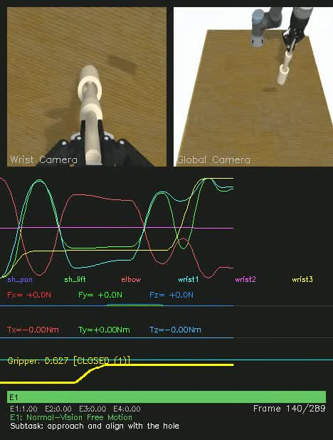
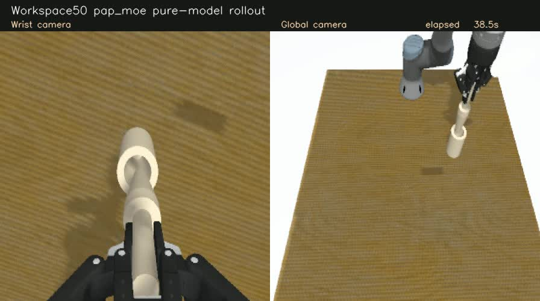

# PAP-MoE · UR3 多模态机器人操作

基于 **ROS 2、Gazebo、MoveIt 2 和 LeRobot** 的机器人学习工作区，集成 UR3 机械臂、Robotiq 2F-85 夹爪、FT300 六维力/力矩传感器及腕部/全局双相机，提供从**轨迹采集、数据转换、策略训练到闭环推理**的完整开发流程。

项目以轴孔装配为当前验证任务，支持 Pi0.5、ACT、Diffusion Policy 基线，以及基于 Pi0.5 扩展的 **PAP-MoE 物理感知专家策略**。

## 演示

### 采集数据样本

[](docs/assets/workspace50_sample_0001.mp4)

[播放 / 下载数据样本视频](docs/assets/workspace50_sample_0001.mp4)

使用项目的 `pap_moe_peg_in_hole_make_video.py`，从 Workspace50 的 **0001 号成功示范**生成。视频展示腕部与全局图像、机械臂关节、夹爪、FT300 信号和四专家软路由标签，按数据的 **10 Hz** 播放。这是采集数据可视化，不是模型推理。

### PAP-MoE 闭环推理

[](docs/assets/pap_moe_success.mp4)

[播放 / 下载模型推理视频](docs/assets/pap_moe_success.mp4)

PAP-MoE 在 Gazebo 中完成 peg 抓取、运输与轴孔插入，使用 **PhysicsGate 在线预测路由、50 步预测 / 10 步执行及 RTC**，无人工或示教专家接管。展示案例为场景 **0031 / seed2**，原始录像约 26 秒，按本项目插入判据成功。

以上均为仿真演示。单条成功案例不代表总体成功率或释放稳定性；视频来源、检查点与校验值见 [演示清单](docs/assets/demo_manifest.json)，批量结果与判定口径见 [实验报告](docs/reports/PAP_MoE推进顺序与实验结论_简版_20260907.md)。

## 主要功能

- **任务仿真**：UR3、FT300、2F-85、双相机与轴孔场景；支持 Gazebo 和 RViz 可视化。
- **轨迹采集**：脚本示范、键鼠操作、同位置多风格轨迹，以及独立的 rollout recovery 采集工具。
- **数据处理**：多模态记录、样本校验、LeRobot 格式转换、全帧归一化统计与数据视频生成。
- **策略训练**：Pi0.5、ACT、Diffusion Policy 与 PAP-MoE 的训练和评估入口。
- **闭环部署**：动作块预测、RTC、观测/动作请求配对，以及模型常驻与逐条重启 Gazebo 的评估工具。
- **诊断评估**：开环误差、完整 Flow 回放、闭环任务结果、控制器跟踪和接触几何检查。

## PAP-MoE 架构

PAP-MoE 使用四个物理感知专家提取不同工况下的信息，由 PhysicsGate 预测未来动作步对应的软路由。专家特征在**动作专家 Transformer 计算之前**融合，作为完整动作生成的条件。

```text
双相机 / 语言       关节状态与历史       FT300 快慢时间窗
       └──────────────────┬──────────────────┘
                          │
           ┌──────────────┴───────────────┐
           │                              │
     PhysicsGate                     四物理感知专家
  预测50步物理三因子             E1：正常视觉自由运动
  视觉失效 / 接触 / 可运动性     E2：视觉退化备援
           │                    E3：刚性约束接触
     50 × 4 软路由              E4：可运动/顺应接触
           └──────────────┬───────────────┘
                    逐动作步条件融合
                          │
              Pi0.5 Action Expert / Flow
                          │
                预测50步 → 执行前10步
                          │
                 新观测 + RTC剩余动作
```

当前方案不使用 subtask、skill-progress 或独立夹爪决策头。四专家提供特征，最终机械臂与夹爪动作由动作专家生成。物理专家的专项收益仍在验证，详见 [当前研究状态](docs/PAP_MOE新对话接手指南.md)。

## 环境准备

当前使用的环境：

| 组件 | 版本 / 配置 |
|---|---|
| 系统 | Ubuntu 22.04 |
| ROS / 仿真 | ROS 2 Humble、Gazebo Fortress、MoveIt 2 |
| Python | ROS：3.10；学习：3.12.13 |
| 学习框架 | PyTorch 2.10.0、Transformers 5.6.0、LeRobot 0.5.2 |
| 观测与动作 | 双相机224×224 RGB；7维关节状态与绝对动作；FT300六维信号 |

ROS 和学习环境应分开使用。依赖记录见 [`learning/environment.json`](learning/environment.json)。部分研究脚本保留本机路径 `/home/ubuntu/ur3_ft300_ws`、`/home/ubuntu/lerobot` 和 `pi0-env`；部署到其他目录时，需先调整对应脚本中的路径配置，见 [运行说明](docs/RUNNING.md)。

### 1. 获取代码与构建仿真

先安装 ROS 2 Humble、Gazebo Fortress、MoveIt 2、ros2_control、colcon 和 rosdep。

```bash
git clone https://github.com/cjx-cell/ur3_ft300_ws.git ~/ur3_ft300_ws
cd ~/ur3_ft300_ws

source /opt/ros/humble/setup.bash
rosdep install --from-paths src --ignore-src -r -y
colcon build --symlink-install
source install/setup.bash
```

### 2. 准备学习代码

项目通过**锁定上游 LeRobot + 项目源码增量**提供学习实现，无需将整个上游仓库纳入本工作区。以下命令创建新目录，不会覆盖已有 LeRobot 环境：

```bash
# 目标目录必须不存在
python3 scripts/prepare_learning_source.py --destination ~/lerobot-pap

# 切换到独立的学习环境，按依赖说明安装
conda activate pi0-env
python -m pip install -e ~/lerobot-pap
```

详见 [LeRobot 集成说明](docs/LEROBOT_INTEGRATION.md)。模型权重、tokenizer 与数据需另行准备；公开仓库不包含全部训练数据或微调检查点。

## 使用流程

### 1. 启动 Gazebo 与 RViz

```bash
source /opt/ros/humble/setup.bash
source install/setup.bash
ros2 launch ur_simulation_gz ur3_ft300_robotiq.launch.py
```

需要规划与相机可视化时，在另外两个已 source 相同环境的终端中分别运行：

```bash
ros2 launch ur3_ft300_moveit_config move_group.launch.py
ros2 launch ur3_ft300_moveit_config moveit_rviz.launch.py
```

### 2. 采集数据

脚本示范入口：

```bash
# 使用新的输出目录，避免覆盖已有数据
PAP_MOE_PILOT_ROOT=/path/to/new_raw \
  bash scripts/run_pap_moe_v9_exactfit_collection.sh true 1
```

这是单条采集入口；批量采集的位置、风格与编号需按 manifest 管理。键鼠采集入口为 `pap_moe_framework/scripts/start_teleop_workspace_50.sh`，其采集验收仍在完善，使用前参阅 [运行说明](docs/RUNNING.md)。

### 3. 校验、转换与计算统计

以下命令在学习环境中执行：

```bash
python pap_moe_framework/scripts/validate_multimodel_data_contract.py /path/to/new_raw

python pap_moe_framework/scripts/pap_moe_peg_in_hole_convert_to_lerobot.py \
  --input /path/to/new_raw --output_dir /path/to/lerobot_full \
  --repo_id local/ur3_full --model_view full --fps 10 --source_fps 10

python pap_moe_framework/scripts/recompute_lerobot_numeric_stats.py \
  /path/to/lerobot_full --output /path/to/lerobot_full_global_stats
```

`full` 保留 PAP-MoE 的力、历史和路由监督字段；`--model_view baseline` 生成 Pi0.5/ACT/DP 使用的基础视图。两种视图应来自同一批原始轨迹。不要覆盖旧检查点对应的归一化统计。

数据视频生成：

```bash
python pap_moe_framework/scripts/pap_moe_peg_in_hole_make_video.py \
  --raw_dir /path/to/new_raw --episode 0001 --fps 10 \
  --output-dir /path/to/videos
```

### 4. 训练策略

先准备兼容的数据、预训练权重和 tokenizer，再检查入口中的路径与训练配置：

| 策略 | 训练入口 |
|---|---|
| Pi0.5 | `scripts/run_pi05_workspace50_official_lowmem_expert_only_30k.sh` |
| ACT | `scripts/run_workspace50_corrected_act.sh` |
| Diffusion Policy | `scripts/run_workspace50_corrected_diffusion.sh` |
| PAP-MoE | `scripts/run_pap_moe_vnext_stage_train.sh`、`scripts/train_pap_checked.py` |

PAP-MoE 按真实路由下专家/动作联合训练、PhysicsGate监督训练、Gate端到端适配分阶段推进。不同研究检查点的配置和冻结范围须与其训练合同对应，详见 [脚本导航](scripts/README.md) 和 [接手文档](docs/PAP_MOE新对话接手指南.md)。

### 5. Gazebo 推理与评估

```bash
# CHECKPOINT指向包含config、processor和权重的pretrained_model目录
CHECKPOINT=/path/to/pretrained_model
bash scripts/run_workspace50_lerobot_policy_gazebo.sh pap_moe "$CHECKPOINT" 1 true
```

策略参数可替换为 `pi05`、`act` 或 `diffusion`。此入口还需要 Workspace50 场景 manifest。默认冷加载入口与研究中的冻结修复版不可混用计分；常驻模型和配对评估工具位于 `scripts/resident_policy/`。

## 项目结构与文档

| 路径 | 用途 |
|---|---|
| `src/` | ROS描述、驱动集成、仿真、MoveIt和采集/推理桥 |
| `pap_moe_framework/` | 采集、数据转换、统计、物理先验、恢复协议和测试 |
| `learning/` | LeRobot上游锁定、PAP源码增量及回归测试 |
| `scripts/` | 训练、推理、评估和诊断入口 |
| `docs/` | 使用说明、架构/实验记录、演示与接手文档 |

- [详细运行说明](docs/RUNNING.md)
- [当前任务与研究状态](docs/PAP_MOE新对话接手指南.md)
- [实验结果与分析](docs/reports/PAP_MoE推进顺序与实验结论_简版_20260907.md)
- [来源、贡献与许可证](docs/CONTRIBUTIONS.md)

项目沿用 LeRobot/OpenPI、ROS 2、MoveIt 2、Universal Robots、Robotiq及RealSense等开源组件；各组件保留原有许可证。旧 SA-MoE 已退役，历史说明见 [LEGACY_SA_MOE.md](docs/LEGACY_SA_MOE.md)。
